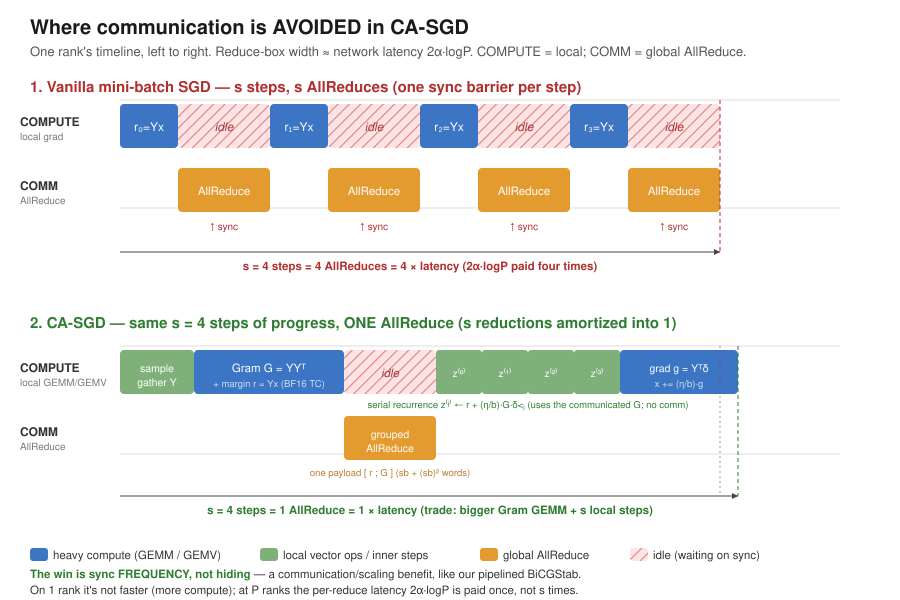
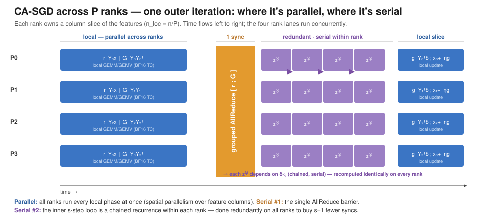
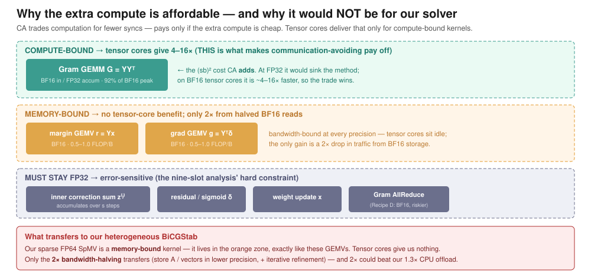

# Mixed-Precision Communication-Avoiding SGD — and what it means for our solver

A reading note on Devarakonda, Simó Muñoz & Guidi, *"Mixed-Precision
Communication-Avoiding SGD for Generalized Linear Models on GPUs"* (arXiv
2606.18463, June 2026), and how its ideas relate to the heterogeneous
CPU+GPU BiCGStab work in this repository.

Paper PDF: `data/temporary/papers/Mixed-precision-communication-avoiding-shd-for-generalized-linear-models-on-gpus-2606.18463v1.pdf`

---

## TL;DR

- The paper attacks the **same bottleneck we do** — the global reduction
  (`AllReduce` / dot product) that synchronizes every iteration of a
  distributed iterative method.
- It uses a **different tactic** than our pipelined BiCGStab. We *hide*
  communication (overlap each reduction under a SpMV). It *avoids*
  communication (do more local compute so it synchronizes once per `s` steps
  instead of every step). Same bottleneck, opposite move: **overlap vs.
  amortize**.
- Its headline result (5.1–6.8× over FP32 SGD on A100) comes from **mixed
  precision on tensor cores** making the extra computation cheap. That is the
  one lever we have **not** pulled.
- **The catch for us:** their compute win is a *dense* Gram GEMM that tensor
  cores love. Our SpMV is *sparse* and memory-bandwidth-bound — tensor cores
  give it nothing. Only the **2× bandwidth-halving from lower-precision
  storage** transfers. That 2× could still beat our 1.3× CPU-offload win.

---

## 1. What the paper does

It trains **Generalized Linear Models** (logistic, linear, Poisson
regression — see the link-function family) with distributed mini-batch SGD,
and makes two changes:

### Communication-avoiding (s-step)

Vanilla mini-batch SGD does one length-`b` `AllReduce` **per step**. Over `s`
steps that is `s` synchronizations, and the latency term `2α·logP` of each is
paid `s` times. CA-SGD instead samples `sb` rows at once, forms the `sb × sb`
**Gram matrix** `G = YYᵀ` and base margin `r = Yx`, and does **one** grouped
`AllReduce` of `[r ; G]`. It then replays what the `s` steps would have done
with a purely local, redundant inner recurrence
`z⁽ʲ⁾ ← r + (η/b)·G·δ_<ⱼ`, using the already-communicated `G`.

Net: `s` reductions → **1**. The price is a bigger `(sb)²` Gram GEMM plus the
`s`-step local inner loop, done redundantly on every rank.

### Mixed precision (the enabler)

A nine-slot finite-precision analysis (Theorem 5.7) assigns each kernel its own
precision. The recommended **Recipe C** stores the matrix and runs the Gram
GEMM / GEMVs in **BF16 with FP32 accumulation**, but keeps the error-sensitive
**inner correction sum in FP32** (a hard constraint the analysis exposes — a
uniform-BF16 recipe would silently break it). Because the added `(sb)²` Gram
work runs on BF16 tensor cores (~92% of BF16 peak), the extra computation that
communication-avoiding introduces is nearly free — which is what makes the
trade pay off. Their residual-stability argument builds directly on **Carson &
Demmel's residual replacement** for s-step Krylov methods (their ref [4]).

Results: 5.1–6.8× over FP32 SGD on NERSC Perlmutter A100s, scaling to 256 GPUs.

---

## 2. Diagrams

Three figures, in the same visual language as our pipelined-BiCGStab diagrams
(`docs/pipelined-bicgstab-*.svg`). Blue = heavy compute, green = local vector
ops, orange = global reduction, hatched = idle.

### 2a. Communication is *avoided*, not hidden

One rank's timeline. Vanilla SGD (top) fires the network `s` times, each a sync
barrier. CA-SGD (bottom) does the same `s` steps of progress with **one**
`AllReduce`, paying the `2α·logP` latency once. Contrast this with our pipelined
BiCGStab, where the COMM lane runs *underneath* a SpMV — here it instead fires
once and then sits idle while the local inner loop reconstructs the `s` steps.

### 2b. Where it is parallel, where it is serial

One outer iteration across four ranks. **Parallel:** every local phase runs on
all ranks at once (spatial parallelism over the feature columns each rank owns).
**Serial point #1:** the single grouped `AllReduce` barrier — the only
cross-rank interaction per outer iteration. **Serial point #2:** the inner
`s`-step recurrence is a chained dependency *within* each rank, computed
redundantly on every rank to buy `s−1` fewer syncs (the compute-for-
communication trade).

### 2c. Why the extra compute is affordable (and why it would not be for us)

The Gram GEMM is **compute-bound**, so BF16 tensor cores give it 4–16× — that is
what rescues the trade. The margin/gradient GEMVs are **memory-bound**, so they
get only 2× from halved BF16 reads (no tensor-core benefit). A few kernels
**must stay FP32**. The red callout is the point for us: **our sparse FP64 SpMV
lives in the memory-bound zone**, exactly like those GEMVs.

---

## 3. Relation to our BiCGStab work

### Same bottleneck, two families of fix

| | strategy | our implementation |
|---|---|---|
| **Communication-*hiding*** (Cools & Vanroose 2017) | overlap each reduction behind the SpMV (`MPI_Iallreduce`) | `bicgstab-mpi-gpu-pipelined`, `bicgstab-hybrid-dist-pipelined` |
| **Communication-*avoiding*** (this paper; Carson, Hoemmen) | batch `s` reductions into one larger one | — (not implemented) |

Both belong to the same lineage of reduction-reducing Krylov/optimization
methods, and both need the same stabilizer.

### Residual replacement = our `HHP_REPLACE`

The paper's stability argument rests on Carson & Demmel's residual replacement
[4] — periodically recomputing the recurrence-maintained quantities from their
true definitions to kill accumulated rounding drift. That is **exactly what our
`HHP_REPLACE=k` knob does** in the pipelined solvers (every `k` iterations it
pays 6 SpMVs to reset `r, w, t, s, z, v`). So our RR is not ad hoc; it is the
standard fix for any reduction-reformulated recurrence.

### Their single-node economics match our measured result

The paper's Table 6 shows CA-SGD is a **loss at `s = 1`** (0.67–0.92×) and only
wins at large `s` with many GPUs. Their stated principle: trading computation
for fewer syncs pays **only when communication is expensive AND the extra
computation is cheap.** That is precisely why our pipelined hybrid loses on a
single node — more arithmetic (6 dots + 8 vecops/iter vs. 4 + 6), with no
expensive cross-node reduction to hide. They rescued the trade with tensor
cores; we had no way to make pipelining's extra vector work cheaper, so
single-node it stays below 1.0× (measured 0.86–0.90× of `bicgstab-gpu`). Same
economics, same conclusion.

### What actually transfers

1. **Mixed-precision storage for the SpMV (the real opportunity).** Our SpMV is
   memory-bandwidth-bound. Storing `A` and the vectors in FP32 (or BF16) instead
   of FP64 halves the memory traffic → up to ~2× on the dominant cost, *bigger
   than the 1.3× we got from the CPU offload* — and it lets a 2× larger matrix
   fit in the 8 GB VRAM. Accuracy is recovered with mixed-precision iterative
   refinement (Carson–Higham, the paper's refs [6,7,8]).
2. **Reduction-payload precision (multi-node only).** Casting the dot/`Iallreduce`
   payloads to FP32/BF16 (their Recipe D casts the Gram `AllReduce` to BF16 for
   up to 6.8×) halves network traffic — directly attacking the bottleneck our
   pipelining targets, in the multi-node regime we have not yet measured.

### What does **not** transfer

Most of their 5–6× comes from a **dense** Gram GEMM hitting 92% of BF16
tensor-core peak. Their own roofline (Fig. 5) shows the **memory-bound GEMVs**
getting *zero* tensor-core benefit, only the 2× storage halving. Our sparse SpMV
is in that same memory-bound regime — so **tensor cores are irrelevant to us**;
the only mixed-precision win available is the bandwidth halving.

---

## 4. Suggested next step

Prototype an **FP32 (or mixed-precision) SpMV path** and measure the bandwidth
win on our matrices. If it delivers close to 2× on the SpMV — the dominant cost
in every solver variant — it would be a larger lever than the heterogeneous CPU
split, stacks with it, and doubles the matrix size that fits in VRAM. Pair it
with iterative refinement to keep FP64-level accuracy.
